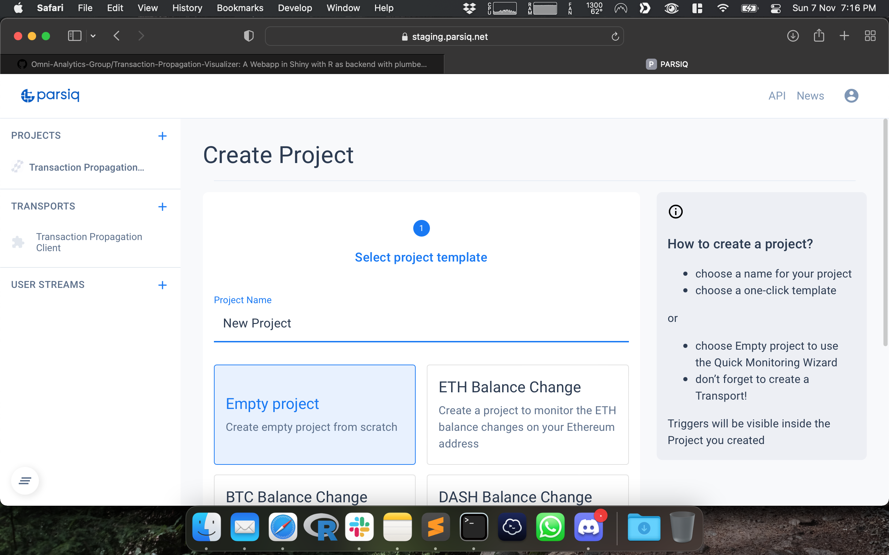
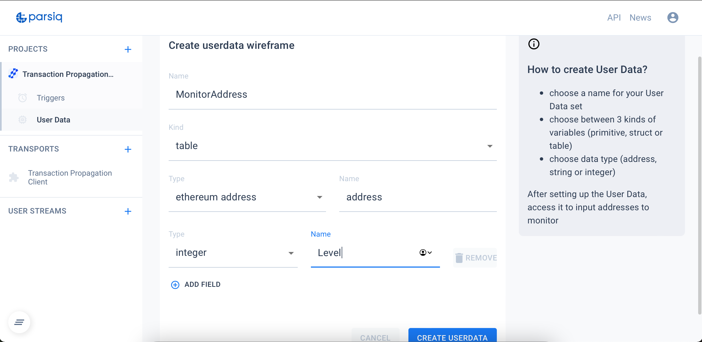

# Transaction-Propagation-Visualizer
A Web App in Shiny with R as backend with plumber API and using PARSIQ Smart Triggers

## [App Walkthrough on YouTube](https://www.youtube.com/watch?v=GpWZLMB2lvM)

## Video Preview GIF

## Setup Process
- Create a New Empty Project on PARSIQ

- Create a New Table under User Data named `MonitorAddress` and with fields `address` and `Level`

