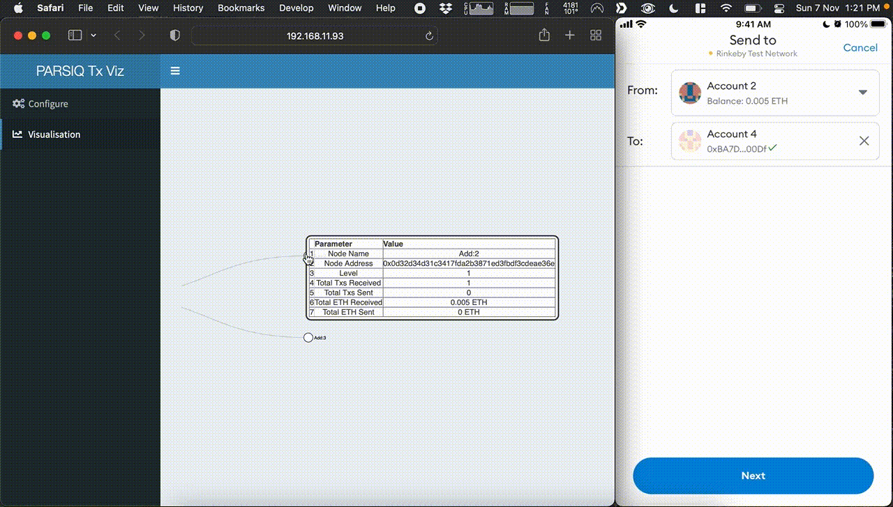

# Transaction-Propagation-Visualizer
A Web App in Shiny with R as backend with plumber API and using PARSIQ Smart Triggers

## [App Walkthrough on YouTube](https://www.youtube.com/watch?v=GpWZLMB2lvM)

## Video Preview GIF

## Setup Process
- Install the reticulate package using `library(reticulate)`
