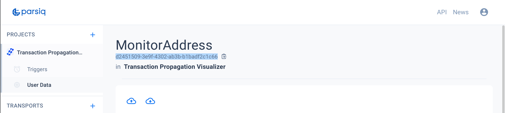
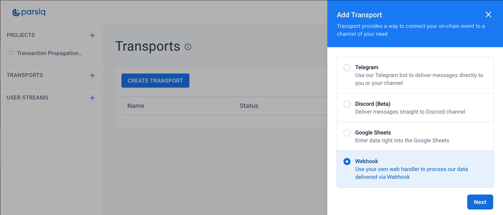
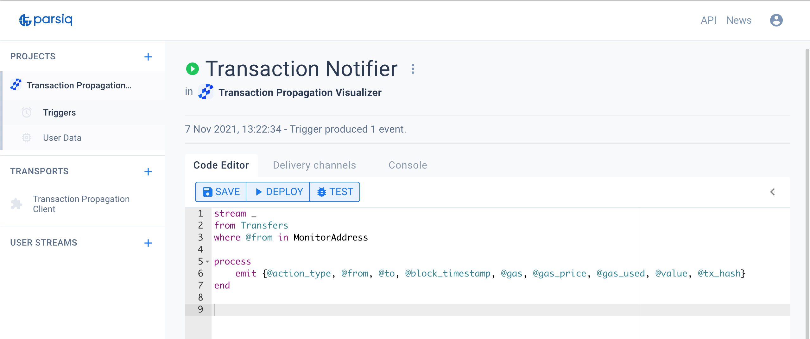
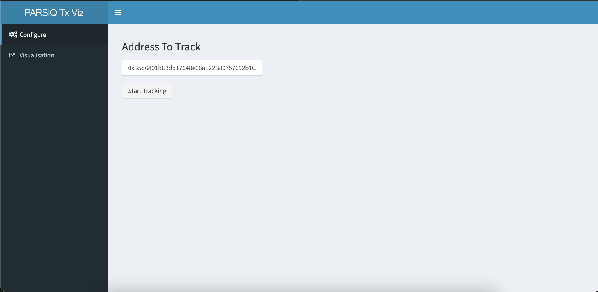
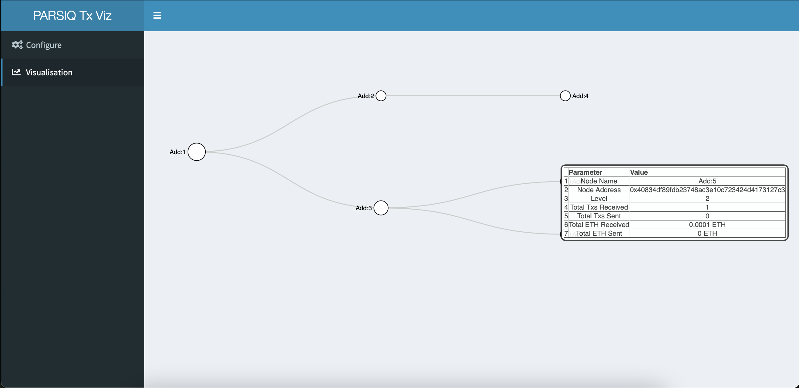

# Transaction-Propagation-Visualizer
A Web App in Shiny with R as backend with plumber API and using PARSIQ Smart Triggers

## [App Walkthrough on YouTube](https://www.youtube.com/watch?v=GpWZLMB2lvM) <<< Click Here

## Video Preview GIF
[](https://www.youtube.com/watch?v=GpWZLMB2lvM)

## Setup Backend
- Start the R backend which has the API code to listen on port `6789`
`Rscript start_api.R`

- Expose the PORT 6789 using ngrok and copy the http address to use later


- Create a New Empty Project on PARSIQ


- Create a New Table under User Data named `MonitorAddress` and with fields `address` and `Level`


- Copy Project API Key and put in under `proj_api_key` in `env.R` file


- Copy MonitorAddress Table Key and put in under `table_id` in `env.R` file


- Create a new Webhook Transport with the http address we got from ngrok window.


- Create a new Trigger and add the webhook Transport we generated above in its deliver channels.


- Trigger Code

```
stream _
from Transfers
where @from in MonitorAddress

process
    emit {@action_type, @from, @to, @block_timestamp, @gas, @gas_price, @gas_used, @value, @tx_hash}
end
```

- Deploy the Trigger

## Start the App

- Start the app using `shiny::runApp()` in R console after setting the project directory as working directory

## Using the App

- In the Configure panel of the app, we can set an Ethereum Address to track.


- The Visualisation panel of the app contains the collapsible network plot, where each node represents and Ethereum Address and we can hover on it to see its stats.


- The Network Plot updates in real time as soon we see a new transaction in Transaction Propogation Network.

## [App Walkthrough on YouTube](https://www.youtube.com/watch?v=GpWZLMB2lvM) <<< Click Here

## About Us

[Omni Analytics Group](https://omnianalytics.io) is an incorporated group of passionate technologists who help others use data science to change the world. Our  practice of data science leads us into many exciting areas where we enthusiastically apply our machine learning, artificial intelligence and analysis skills. Our flavor for this month, the blockchain!  To learn more about what we do or just to have fun, join us over on [Twitter](https://twitter.com/OmniAnalytics).


